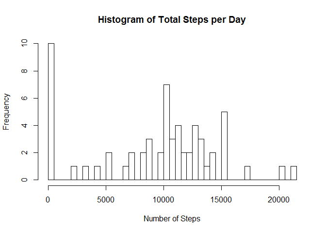
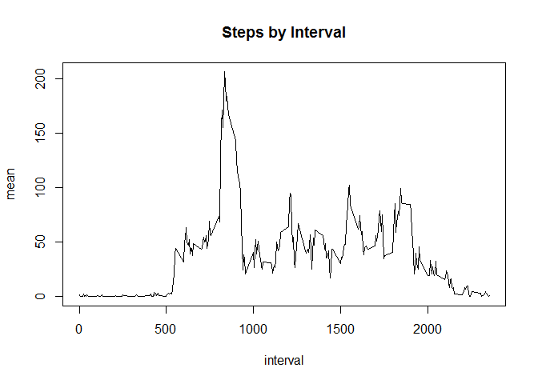
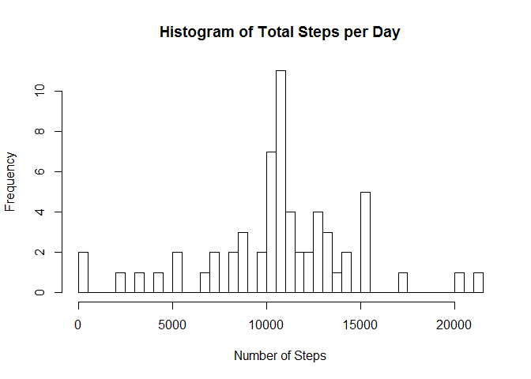
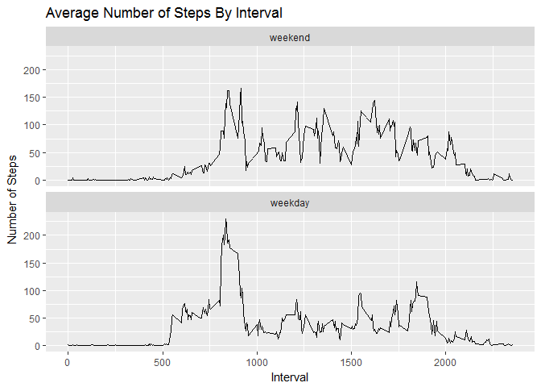

## Loading and preprocessing the data

```r
library(dplyr)
```

```
## Warning: package 'dplyr' was built under R version 3.4.4
```

```
## 
## Attaching package: 'dplyr'
```

```
## The following objects are masked from 'package:stats':
## 
##     filter, lag
```

```
## The following objects are masked from 'package:base':
## 
##     intersect, setdiff, setequal, union
```

```r
library(ggplot2)
```

```
## Warning: package 'ggplot2' was built under R version 3.4.3
```

```r
activity <- read.csv("activity/activity.csv")
activity <- mutate(activity, date = as.Date(as.character(activity$date)))
```

```
## Warning: package 'bindrcpp' was built under R version 3.4.4
```


## What is mean total number of steps taken per day?

```r
steps_per_day <- group_by(activity, date)
steps_per_day <- summarize(steps_per_day, total = sum(steps, na.rm = TRUE))
hist(steps_per_day$total, breaks=61, main="Histogram of Total Steps per Day", xlab = "Number of Steps")
```

<!-- -->

```r
mean <- mean(steps_per_day$total, na.rm=TRUE)
median <- median(steps_per_day$total, na.rm=TRUE)
```

Mean of the total number of steps taken each day is **_9354.2295082_**

Median of the total number of steps taken each day is **_10395_**

## What is the average daily activity pattern?

```r
steps_per_interval <- group_by(activity, interval)
steps_per_interval <- summarize(steps_per_interval, mean = mean(steps, na.rm=TRUE))
plot(steps_per_interval, type='l', main="Steps by Interval")
```

<!-- -->

```r
max_index <- which(steps_per_interval$mean == max(steps_per_interval$mean))
max <- steps_per_interval[max_index, ]$interval
```

Interval **_`835_** contains the maximum number of steps on average across all the days in the dataset.

## Imputing missing values

```r
num_of_missing <- sum(is.na(activity$steps))

na <- which(is.na(activity$steps))
match <- match(activity[na,]$interval, steps_per_interval$interval)
activity2 <- activity
activity2[na, ]$steps <- steps_per_interval[match, ]$mean

steps_per_day <- group_by(activity2, date)
steps_per_day <- summarize(steps_per_day, total = sum(steps, na.rm = TRUE))
hist(steps_per_day$total, breaks=61, main="Histogram of Total Steps per Day", xlab = "Number of Steps")
```

<!-- -->

```r
mean <- mean(steps_per_day$total, na.rm=TRUE)
median <- median(steps_per_day$total, na.rm=TRUE)
```

There are  **_2304_** missing values.

Mean of the total number of steps taken each day is **_1.0766189\times 10^{4}_**

Median of the total number of steps taken each day is **_1.0766189\times 10^{4}_**

There are now fewer days with 0 total number of steps.

## Are there differences in activity patterns between weekdays and weekends?

```r
activity3 <- mutate(activity2, day = ifelse(weekdays(date) == "Saturday" | weekdays(date) == "Sunday", "weedend", "weekday"))
activity3$day <- factor(activity3$day, labels = c("weekend", "weekday"))

steps_per_interval <- group_by(activity3, day, interval)
steps_per_interval <- summarize(steps_per_interval, mean = mean(steps, na.rm=TRUE))

ggplot(steps_per_interval, aes(x = interval , y = mean)) +
       geom_line() +
       labs(title = "Average Number of Steps By Interval", x = "Interval", y = "Number of Steps") +
       facet_wrap(~day, ncol = 1, nrow=2)
```

<!-- -->
